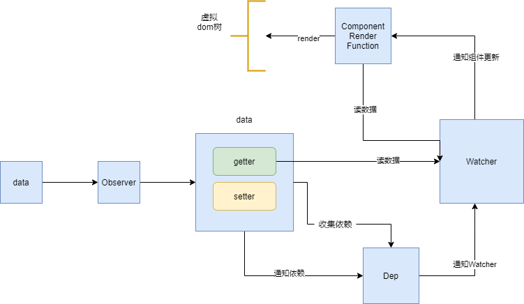

# 依赖收集

## 依赖
- vue1.x: 细粒度依赖，用到数据的DOM都是依赖
- vue2.x：中等粒度依赖：用到数据的组件是依赖

<mark>
  在getter中收集依赖，在setter中触发依赖
</mark>

## Dep实例和Watcher类
- 把依赖收集的代码封装成一个Dep类，他专门用来管理依赖，每个Observer实例，成员中都有一个Dep实例
- Watcher是一个中介，数据发生变化时通过Watcher中转，通知组件

- 依赖就是Watcher。只有Watcher触发的getter才会收集依赖，哪个Watcher出发了getter，就把哪个Watcher收集到Dep中
- Dep使用发布订阅模式，当数据发生了变化，会循环依赖列表，把所有的Watcher通知一遍
- 巧妙之处：Watcher把自己设置到全局的一个指定的位置，然后读取数据，因为读取了数据，就会触发getter，在getter中就能读取到正在读取数据的Watchwe，并把这个Watcher收集到Dep中