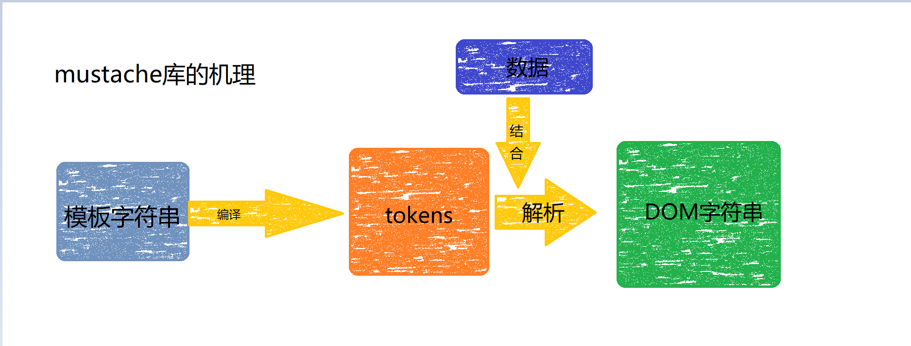
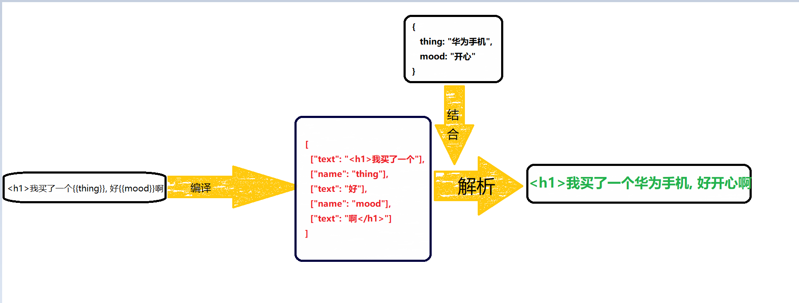

# mustache 的机理



## tokens
- tokens是一个js的嵌套数组，就是模板字符串的js表示
- 他是抽象语法树，虚拟节点的开山鼻祖
- 如 
  - 模板语法
  ```html
    <h1>我买了一个{{thing}}, 好{{mood}}啊</h1>
  ```

  - tokens,一个数组就是一个token，下面的示例就有五个token
  ```js
    [
      // 前面是该token的类型
      ["text": "<h1>我买了一个"],
      ["name": "thing"],
      ["text": "好"],
      ["name": "mood"],
      ["text": "啊</h1>"]
    ]
  ```
  

- 对于模板中存在循环的话
  
```html
<div>
    <ul>
      {{#arr}}
        <li>{{.}}</li>
      {{/arr}}
    </ul>
  </div>
```

转换成tokens就是
```js
[
  ["text": " <div><ul>"],
  ["#", "arr", [
    ["text": "<li>"],
    ["name": "."],
    ["text": "</li>"]
  ]],
  ["text": "</ul></div>"]
]
```
双重循环以此类推，往里面嵌套

## mutache底层的核心
- 将模板字符串编译成token形式
- 将token结合数据，解析成dom字符串

源码中256行的
```js
  return nestTokens(squashTokens(tokens)); // return的就是tokens
```
