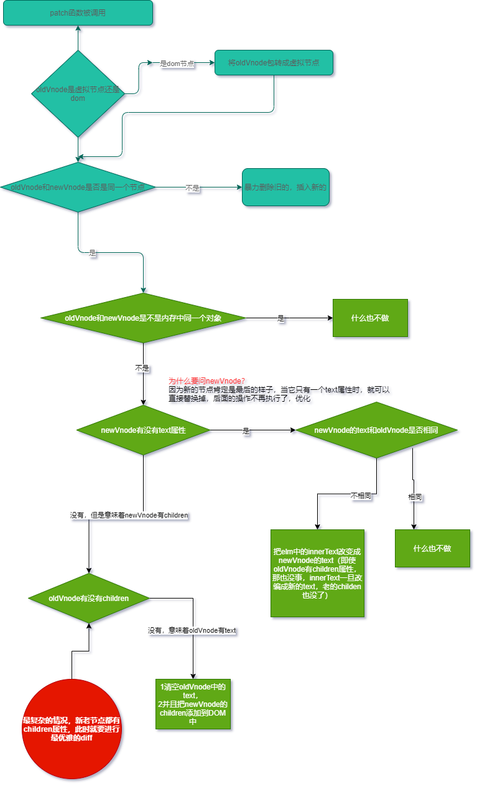

# 虚拟dom
<mark>用JavaScript对象描述Dom层次结构，dom中一切属性都在虚拟dom中有对应的属性</mark>

## 真虚拟dom

- 真实DOM
```html
<div class="box">
    <h3>我是一个标题</h3>
    <ul>
      <li>牛奶</li>
      <li>咖啡</li>
      <li>可乐</li>
    </ul>
  </div>
```

- 虚拟DOM
```json
{
  "sel": "div",
  "data": {
    "class": {
      "box": true
    }
  },
  "children": [
    {
      "sel": "h3",
      "data": {},
      "text": "我是一个标题"
    }, {
      "sel": "ul",
      "data": {},
      "children": [
        {"sel": "li", "data": {}, "text": "牛奶"},
        {"sel": "li", "data": {}, "text": "咖啡"},
        {"sel": "li", "data": {}, "text": "可乐"}
      ]
    }
  ]
}
```

## 为什么要虚拟DOM
新虚拟DOM和老虚拟DOM进行diff(精细化比较)，算出应该如何最小量更新，最后反映到真实的DOM上

## 研究目的
DOM变成虚拟DOM，属于模板编辑的范畴
- 虚拟DOM如何被渲染函数（h函数）产生，手写h函数
- diff算法原理
- 虚拟DOM如何通过diff变成真正的DOM

# h函数
h函数用来产生虚拟节点(vnode)

## 栗子
如：
- 调用h函数
  ```js
    // 第一个参数：标签的名字
    // 第二个参数：对象，会存到data中
    // 第三个参数：文本
    h('a', {props: {href="http://www.baidu.com"}}, "text": "百度")
  ```
- 得到的虚拟节点
  ```js
  {
    "sel": "a",
    "data": {
      "props": {
          "href": "http://www.baidu.com"
      }
    },
    "text": "百度"
  }
  ```
- DOM节点
  ```html
  <a href="http://www.baidu.com"></a>
  ```

## 一个虚拟节点有哪些属性

```js
{
  children: undefined,  // 子元素
  data: {},  // 属性，样式
  elm: undefined,  // 这个元素对应的真正的DOM节点，如果undefined说明这个节点还没有上树
  key: undefined,  // 服务于最小更新
  sel: "div",  // 选择器
  text: "我是一个盒子"  // 
}
```

## 创建虚拟节点，上树

```js
import {
  init,
  classModule,
  propsModule,
  styleModule,
  eventListenersModule,
  h,
} from "snabbdom";

// 创建patch函数
const patch = init([classModule, propsModule, styleModule, eventListenersModule]) 

// 创建虚拟节点
var vnode1 = h('a', { props: { href: "http://www.baidu.com" } }, '百度')
console.log(vnode1);

var vnode2 = h('div', {class: {'box': true}}, "我是一个盒子")

// 虚拟节点上树
// 一个容器只能上一个虚拟节点
var container = document.getElementById('container')

// patch(container, vnode1)
patch(container, vnode2)
```

## 嵌套

```js
h('ul', {}, [
  h('li', {}, "牛奶")
  h('li', {}, "咖啡")
  h('li', {}, "可乐")
])
```

```js
{
  "sel": "ul",
  "data": {},
  "chilldren": [
    {"sel": "li", "data": {}, "text": "牛奶"},
    {"sel": "li", "data": {}, "text": "咖啡"},
    {"sel": "li", "data": {}, "text": "可乐"}
  ]
}
```

# diff算法
## 最小量更新
- 尾部添加
```js
const container = document.getElementById('container')
const btn = document.getElementById('btn')


// 创建patch函数
const patch = init([classModule, propsModule, styleModule, eventListenersModule])

var vnode1 = h('ul', {}, [
  h('li', {}, 'A'),
  h('li', {}, 'B'),
  h('li', {}, 'C'),
  h('li', {}, 'D'),
  h('li', {}, 'E')
])

// 上树
patch(container, vnode1)

var vnode2 = h('ul', {}, [
  h('li', {}, 'A'),
  h('li', {}, 'B'),
  h('li', {}, 'C'),
  h('li', {}, 'D'),
  h('li', {}, 'E'),
  h('li', {}, 'F'),
])

btn.addEventListener('click', function () {
  /**
   * 验证：点击按钮前，通过开发者工具，修改vnode1的文本属性，再点击按钮，发现，vnode1部分没有重新渲染，
   * 而是改动了该改动的地方
   */
  patch(vnode1, vnode2)
})
```

上述是在尾部追加更新的，


- 头部添加
```js
import {
  init,
  classModule,
  propsModule,
  styleModule,
  eventListenersModule,
  h,
} from "snabbdom";

/**
 * 体验diff算法
 */
const container = document.getElementById('container')
const btn = document.getElementById('btn')


// 创建patch函数
const patch = init([classModule, propsModule, styleModule, eventListenersModule])

var vnode1 = h('ul', {}, [
  h('li', {}, 'A'),
  h('li', {}, 'B'),
  h('li', {}, 'C'),
  h('li', {}, 'D'),
  h('li', {}, 'E')
])

// 上树
patch(container, vnode1)

var vnode2 = h('ul', {}, [
  h('li', {}, '头部添加'),
  h('li', {}, 'A'),
  h('li', {}, 'B'),
  h('li', {}, 'C'),
  h('li', {}, 'D'),
  h('li', {}, 'E'),
  h('li', {}, 'F'),
])

btn.addEventListener('click', function () {
  /**
   * 验证：点击按钮前，通过开发者工具，修改vnode1的文本属性，再点击按钮，发现，vnode1部分没有重新渲染，
   * 而是改动了该改动的地方
   */
  patch(vnode1, vnode2)
})
```


- 原因


## 为数据添加唯一标识key
上面的问题就可以解决
而且实现最小量更新

## 细节

- 必须是同一个虚拟机节点才会进行精细化比较，否则就会暴力删除旧的，插入新的
同一个虚拟节点：选择器相同 && key相同

- 只会进行同层比较，不会进行跨层比较。即使是同一片虚拟节点，但是跨层了，精细化比较不会diff你，而是暴力删除旧的，插入新的

# diff处理新旧节点不是同一个节点的问题

## pathch流程图



## 手写第一次上树


## createElement函数流程


## 当新老节点都有children属性时

### 新增节点

- 新增节点的情况分析


- 出现bug


<mark>当插入一个节点时，正确，当同时插入2个及以上的节点时，就会报错</mark>

分析及解决

